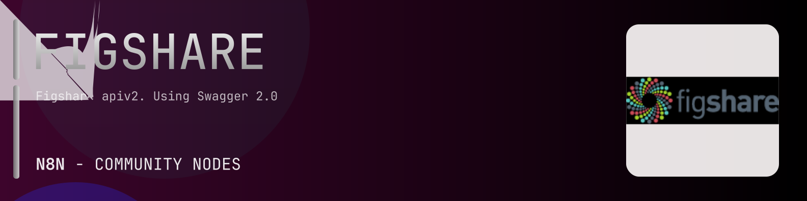

# @n8n-dev/n8n-nodes-figshare



[](https://www.npmjs.com/package/@n8n-dev/n8n-nodes-figshare)
[](https://opensource.org/licenses/MIT)

---

**Stop writing figshare API integrations by hand.**

Every time you connect n8n to figshare, you waste hours mapping endpoints, defining parameters, and debugging schemas. You copy-paste from docs, fix edge cases, and pray nothing breaks.

**What if connecting n8n to figshare took 5 minutes, not half a day?**

This node gives you **6+ resources** out of the box: **Other**, **Articles**, **Authors**, **Institutions**, **Collections**, and 1 more: with full CRUD operations, typed parameters, and zero manual configuration.

---

## What You Get

- **Zero boilerplate**: Resources, operations, and fields are pre-configured and ready to use
- **Full CRUD**: Create, read, update, and delete support where the API allows it
- **Typed parameters**: No more guessing field types
- **Built-in auth**: API key authentication, ready to go
- **Declarative**: Native n8n performance, no custom execute() overhead

---

## Install

```bash
npm install @n8n-dev/n8n-nodes-figshare
```

**Or in n8n:**
1. **Settings → Community Nodes → Install**
2. Search: `@n8n-dev/n8n-nodes-figshare`
3. Click **Install**

---

## Quick Start

1. Install the node (above)
2. Add credentials: **figshare API** → paste your API key
3. Drag the **figshare** node into your workflow
4. Pick a resource → pick an operation → done.

That's it. No configuration files. No code. It just works.

---

## Resources

<details>
<summary><b>Other</b> (7 operations)</summary>

- Get Private Account information
- Post Search Funding
- Get Private Account Licenses
- Get Public Categories
- Get Public File Download
- Get Item Types
- Get Public Licenses

</details>

<details>
<summary><b>Articles</b> (46 operations)</summary>

- Get Private Articles
- Post Create new Article
- Get Account Article Report
- Post Initiate a new Report
- Post Private Articles search
- Delete article
- Get Article details
- Put Update article
- Get List article authors
- Post Add article authors
- Put Replace article authors
- Delete article author
- Get List article categories
- Post Add article categories
- Put Replace article categories
- Delete article category
- Delete article confidentiality
- Get Article confidentiality details
- Put Update article confidentiality
- Delete Article Embargo
- Get Article Embargo Details
- Put Update Article Embargo
- Get List article files
- Post Initiate Upload
- Delete File Delete
- Get Single File
- Post Complete Upload
- Get List private links
- Post Create private link
- Delete Disable private link
- Put Update private link
- Post Private Article Publish
- Post Private Article Reserve DOI
- Post Private Article Reserve Handle
- Post Private Article Resource
- Put Update article version
- Put Update article version thumbnail
- Get Public Articles
- Post Public Articles Search
- Get View article details
- Get List article files
- Get Article file details
- Get List article versions
- Get Article details for version
- Get Public Article Confidentiality for article version
- Get Public Article Embargo for article version

</details>

<details>
<summary><b>Authors</b> (2 operations)</summary>

- Post Search Authors
- Get Author details

</details>

<details>
<summary><b>Institutions</b> (23 operations)</summary>

- Get Private Account Categories
- Get Private Account Institutions
- Get Private Account Institution Accounts
- Post Create new Institution Account
- Post Private Account Institution Accounts Search
- Put Update Institution Account
- Get Private Institution Articles
- Get Private account institution group custom fields
- Post Custom fields values files upload
- Get Private Account Institution embargo options
- Get Private Account Institution Groups
- Get Private Account Institution Group Embargo Options
- Get Institution Curation Review
- Get Institution Curation Review Comments
- Post Institution Curation Review Comment
- Get Institution Curation Reviews
- Get Private Account Institution Roles
- Get List Institution Account Group Roles
- Post Add Institution Account Group Roles
- Delete Institution Account Group Role
- Get Private Account Institution User
- Post Private Institution HRfeed Upload
- Get Public Licenses

</details>

<details>
<summary><b>Collections</b> (32 operations)</summary>

- Get Private Collections List
- Post Create collection
- Post Private Collections Search
- Delete collection
- Get Collection details
- Put Update collection
- Get List collection articles
- Post Add collection articles
- Put Replace collection articles
- Delete collection article
- Get List collection authors
- Post Add collection authors
- Put Replace collection authors
- Delete collection author
- Get List collection categories
- Post Add collection categories
- Put Replace collection categories
- Delete collection category
- Get List collection private links
- Post Create collection private link
- Delete Disable private link
- Put Update collection private link
- Post Private Collection Publish
- Post Private Collection Reserve DOI
- Post Private Collection Reserve Handle
- Post Private Collection Resource
- Get Public Collections
- Post Public Collections Search
- Get Collection details
- Get Public Collection Articles
- Get Collection Versions list
- Get Collection Version details

</details>

<details>
<summary><b>Projects</b> (26 operations)</summary>

- Get Private Projects
- Post Create project
- Post Private Projects search
- Delete project
- Get View project details
- Put Update project
- Get List project articles
- Post Create project article
- Delete project article
- Get Project article details
- Get Project article list files
- Get Project article file details
- Get List project collaborators
- Post Invite project collaborators
- Delete Remove project collaborator
- Post Private Project Leave
- Get List project notes
- Post Create project note
- Delete project note
- Get Project note details
- Put Update project note
- Post Private Project Publish
- Get Public Projects
- Post Public Projects Search
- Get Public Project
- Get Public Project Articles

</details>

---

## Why This Node?

**Without this node:**
- Hours of manual API integration
- Copy-pasting from figshare docs
- Debugging auth, pagination, error handling
- Maintaining your own client code

**With this node:**
- Install → configure → use. 5 minutes.
- Auto-generated from the official figshare OpenAPI spec
- Always up to date when the API changes
- Native n8n performance

---

## Auto-Generated
This node was auto-generated from the official **figshare** OpenAPI specification using
[@n8n-dev/n8n-openapi-node-ultimate](https://github.com/kelvinzer0/n8n-openapi-node-ultimate),
then validated against the live API so you get accurate types and real parameters, not guesswork.

When the figshare API updates, this node updates too.

---


## License

MIT © [kelvinzer0](https://github.com/n8n-code)
